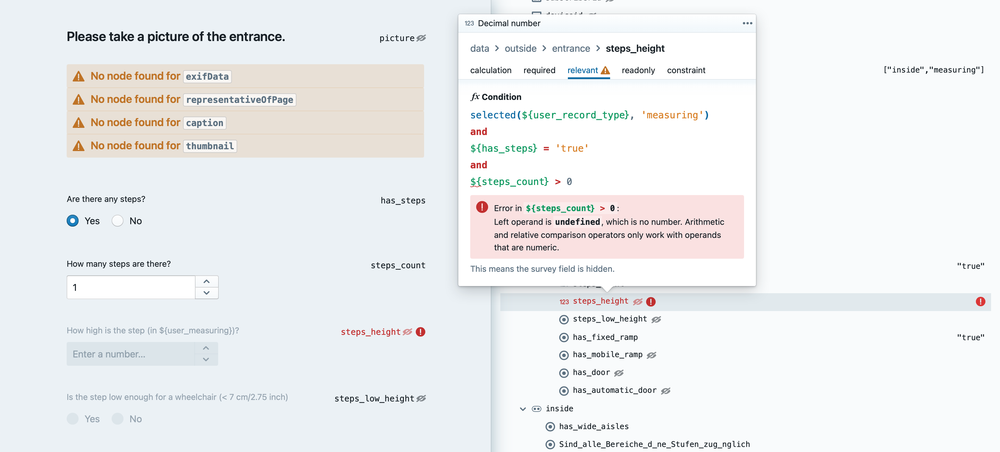
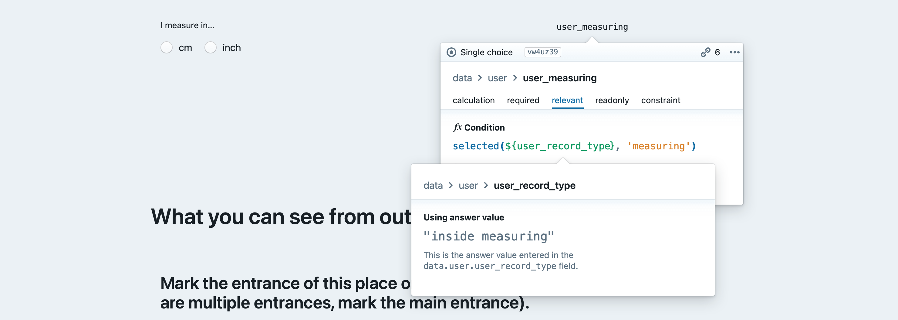
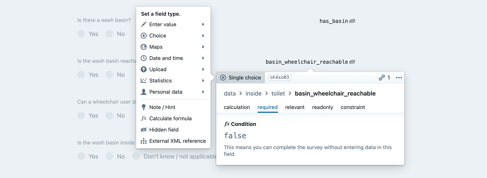

# [XLSForm](http://xlsform.org) survey editor

**⚠️ This is experimental - Please don't expect anything from this app. It has accessibility issues, and probably still some bugs.**

Caveats:

- Not tested in production yet. Built for our own needs, might not fit your requirements
- Supports only a small subset of formula functions
- Can edit, but not show all available field types yet
- No support for repeated field groups

## Demo

https://sozialhelden.github.io/survey-editor/

## Features

- Runs in the browser
- Live synced views (Excel sheet, survey preview, output JSON)
- WYSIWIG editing for [XLSForm](http://xlsform.org) files
- Basic ODK formula support
- Drag & drop
- Localization
- Displays field dependencies
- Helps debugging formula logic visually
- Includes a React component to XLSForm surveys
- Markdown support for field labels, field hints and notes

## Screenshots

Visual debugging for [XLSForm](http://xlsform.org) / ODK formulas:

Click/tap on a variable to see its current value:

Change field types:

Edit the survey structure:

## Development

### Available Scripts

In the project directory, you can run:

#### `yarn start`

Runs the app in the development mode.\
Open [http://localhost:3000](http://localhost:3000) to view it in the browser.

The page will reload if you make edits.\
You will also see any lint errors in the console.

#### `yarn test`

Launches the test runner in the interactive watch mode.\
See the section about [running tests](https://facebook.github.io/create-react-app/docs/running-tests) for more information.

#### `yarn build`

Builds the app for production to the `build` folder.\
It correctly bundles React in production mode and optimizes the build for the best performance.

The build is minified and the filenames include the hashes.\
Your app is ready to be deployed!

See the section about [deployment](https://facebook.github.io/create-react-app/docs/deployment) for more information.

### Create React App (CRA)

This project was bootstrapped with [Create React App](https://github.com/facebook/create-react-app).

You can learn more in the [Create React App documentation](https://facebook.github.io/create-react-app/docs/getting-started).

To learn React, check out the [React documentation](https://reactjs.org/).
